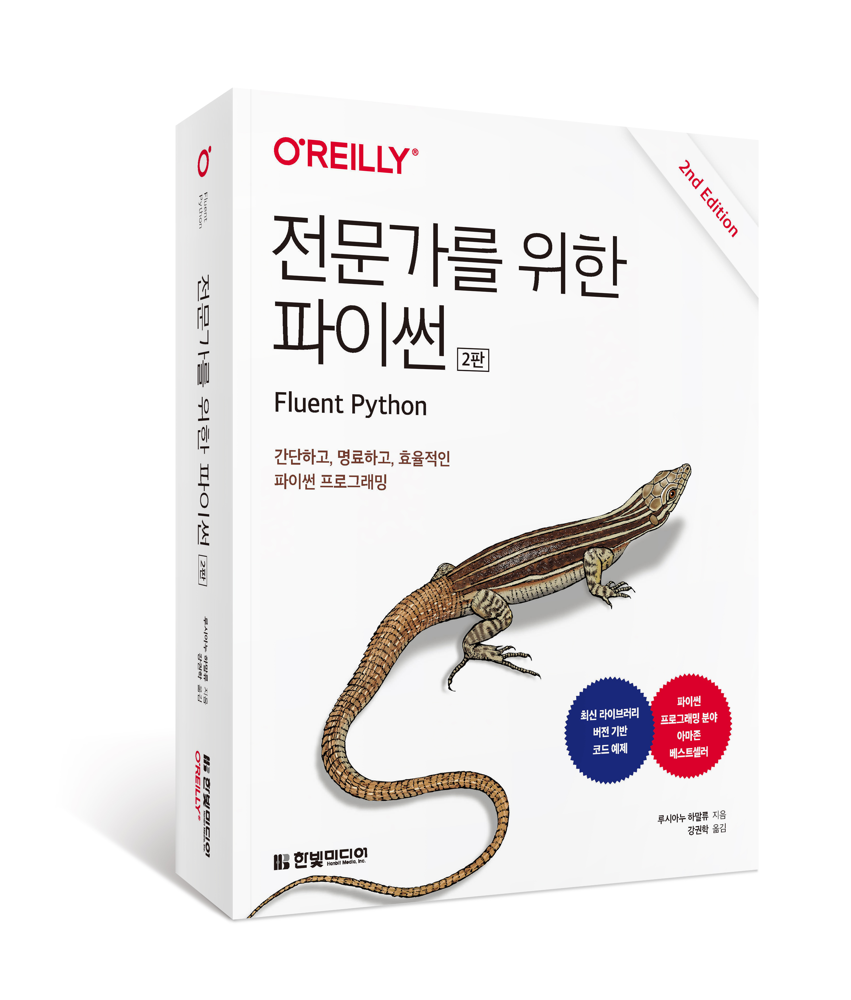

<전문가를 위한 파이썬(2판)> 독자님들께 감사드립니다. 이 페이지는 온라인 자료의 한글 번역본을 제공하기 위해 만들어진 페이지입니다.

현재 번역중인 온라인 자료는 원문을 참조부탁드립니다.

[1. 정렬된 시퀀스를 `bisect`로 관리하기](./article1/article1.md)

[2. `set`과 `dict`의 내부 구조](./article2/article2.md)

[3. 다중 문자 이모지 만들기](./article3/article3.md)

[4. `struct`로 이진 레코드 파싱하기](./article4/article4.md)

[5. Weak References (번역중)](https://www.fluentpython.com/extra/weak-references/)

[6. Introspection of Function Parameters (번역중)](https://www.fluentpython.com/extra/function-introspection/)

[7. Classic Coroutines (번역중)](https://www.fluentpython.com/extra/classic-coroutines/)

예제 소스 코드: https://github.com/fluentpython/example-code-2e
