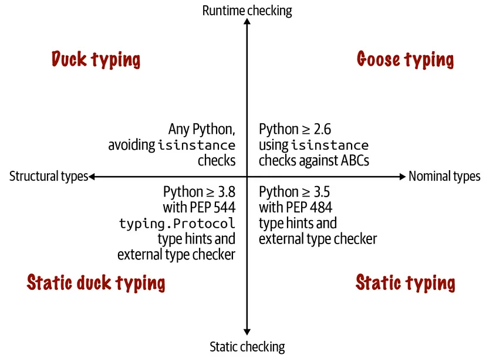
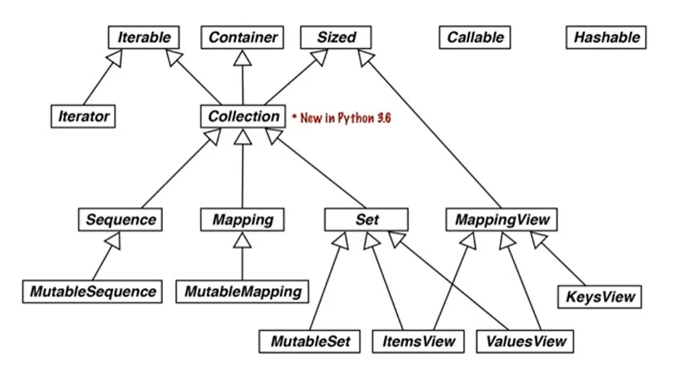

> 구현이 아니라 인터페이스에 맞게 프로그래밍하라.
>

객체지향 프로그래밍은 결국 인터페이스에 관한 것. 파이썬에서 타이핑을 이해하는 가장 좋은 방법은 인터페이스가 제공하는 기법을 이해하는 것.

- 덕 타이핑
- 구스 타이핑
    - 파이썬 2.6부터 추상 베이스 클래스에서 지원하는 타이핑으로, 객체가 ABC 형인지 런타임에서 검사하는 것에 기반
- 정적 타이핑
    - C나 자바처럼 정적으로 자료형을 검사하는 방식. 3.5부터 typing 모듈과 함께 PEP 484를 따르는 외부 자료형 검사기로 검사하는 방법
- 정적 덕 타이핑
    - Go 언어에서 인기를 얻은 방법. 3.8에서 typing.Procotol의 서벜틀래스를 통해 지원하며 외부 자료형 검사기가 필요함.


위와 아래는 파이썬 인터프리터만 이용하느냐 외부 자료형 검사기 (Mypy, IDE 등)이 필요하냐. 왼쪽은 객체의 구조에 따라 즉 클래스의 이름에 상관없이 객체가 제공하는 메서드만 봄. 오른쪽은 명시한 자료형에 따라 자료형을 검사. 즉 객체의 클래스명이나 슈퍼클래스명을 검사

### 두 가지 프로토콜

protocol은 상황에 따라 컴퓨터 과학에서 다양한 의미를 지님. HTTP 등의 네트워크 프로토콜은 GET, PUT, HEAD 등과 같이 클라이언트가 서버에 내릴 수 있는 명령.

‘프로토로과 덕 타이핑’에서는 객체 프로토콜은 객체가 역할을 다하기 위해 제공해야하는 메서드.

ex) [Sequence Protocol](https://docs.python.org/3/c-api/sequence.html)

> int **PySequence_Check**([PyObject](https://docs.python.org/3/c-api/structures.html#c.PyObject) *o)*Part of the [Stable ABI](https://docs.python.org/3/c-api/stable.html#stable).

객체 시퀀스 프로토콜을 지원하면 1을, 아니면 0을 반환한다. dict 서브클래스가 아니라면 __getitem__() 메서드가 있는 파이썬 클래스에 대해 1을 반환한다. (하략)*
>

시퀀스라면  __len__() 메서드를 구현해 len() 함수도 지원해야함. 여러 프로토콜을 다 지원하지 않고 필요한 것만 몇 개 자원할 수 있음. 프로토콜을 종종 ‘비공식 인터페이스’라고도 함.

책에서 구분하는 프로토콜

`동적 프로토콜`

파이썬에서 늘 사용해 온 비공식 프로토콜. 동적 프로토콜은 암묵적이며, 관례적으로 정의됨. 파이썬에서 매우 중요한 동적 프로토콜은 인터프리터 자체에서 지원됨. (len, with, print…)

`정적 프로토콜`

PEP 544에 정의한 프로토콜. 명시적으로 typing.Protocol의 서브클래스로 정의됨

두 프로토콜 간의 차이

- 객체는 동적 프로토콜의 일부만 구현해도 쓸만함. 그러나 정적 프로토콜을 사용할 때는 프로그램에 필요하지 않더라고 프로토콜 클래스에 선언된 메서드를 객체가 모두 제공해야함
- 정적 자료형 검사기는 정적 프로토콜은 검증할 수 있지만, 동적 프로토콜은 검증할 수 없음

### 덕 타이핑

`덕 타이핑` 객체의 실제 자료형은 무시하고, 객체가 용도에 맞는 메서드 이름, 시그니처, 의미를 구현

ex) isinstance() 함수 사용의 회피

시퀀스와 반복형이라는 두 가지 프로토콜을 이용해 동적 프로토콜 알아보기

ABC는 공식적인 “인터페이스 명시” 역할. Sequence ABC를 명시적으로 상속하지 않아도 Sequence처럼 사용이 가능하다.

아래 예시처럼 __iter__()와 __contains__() 메서드를 구현하지 않았지만 반복과 in 연산자가 작동한다.

__getitem__() 메서드를 호출해서 위 메서드를 작동하게 만들기 때문!

```python
class OnlyGetItem:
    def __init__(self, data):
        self.data = data
    
    def __getitem__(self, idx):
        if idx >= len(self.data):
            raise IndexError("Index out of range")
        return self.data[idx]

# 사용 예시
items = OnlyGetItem([10, 20, 30, 40, 50])

# 인덱싱 작동
print(items[0])  # 10
print(items[2])  # 30

# in 연산자 작동
print(20 in items)  # True
print(60 in items)  # False

# 반복문 작동
for item in items:
    print(item, end=' ')  # 10 20 30 40 50

# 리스트 컴프리헨션도 작동
doubled = [x * 2 for x in items]
print(doubled)  # [20, 40, 60, 80, 100]
```

작동 방식은 파이썬 자체에서 대부분 C로 구현되었고, Sequece ABC가 선언한 메서드에 의존하지 않음.

[파이썬 인터프리테어 내장된 작동 방식을 흉내내는 코드](https://github.com/python/cpython/blob/31ceccb2c77854893f3a754aca04bedd74bedb10/Lib/_collections_abc.py#L870)

`멍키 패칭` : 기능을 추가하거나 버그를 수정하고자 런타임에 모듈, 클래스, 함수를 동적으로 변경하는 것.

소스 코드를 건드리지 않고 런타임에 클래스나 모듈을 변경하는 행위

- 예시 코드

    ```python
    import random
    
    # 기본 클래스 (setitem이 없음)
    class SimpleList:
        def __init__(self, items):
            self._items = list(items)
        
        def __getitem__(self, idx):
            return self._items[idx]
        
        def __len__(self):
            return len(self._items)
    
    # setitem 구현하는 함수 정의
    def set_item(self, idx, value):
        self._items[idx] = value
    
    # 멍키 패칭으로 __setitem__ 적용
    SimpleList.__setitem__ = set_item
    
    # 사용 예시
    my_list = SimpleList([1, 2, 3, 4, 5])
    my_list[0] = 10  # 이제 항목 할당 가능
    print(my_list[0])  # 10
    
    # random.shuffle 직접 사용 (setitem이 있어서 가능)
    random.shuffle(my_list)
    for i in range(len(my_list)):
        print(my_list[i], end=' ')  # 무작위 순서로 출력
    
    # 내장 타입(str)에 새 메서드 추가
    def shout(self):
        return self.upper() + "!"
    
    str.shout = shout
    
    # 사용
    print("hello".shout())  # "HELLO!"
    ```


명시적으로 검사할 필요 없이 동적 프로토콜을 알아내는 유용한 코드 패턴

`방어적 프로그래밍과 조기 실패`

안전하고 유지보수하기 쉽게 만드는  ‘조기 실패’ 아래는 그 예시.

객체 초기화 때 반복형이 아니면 TypeError. 이후 발생할 연산에서 에러가 발생하지 않게 방지.

```python
def __init__(self, iterable):
    self._balls = list(iterable)
```

데이터가 너무 크거나 random.shuffle()처럼 인수의 내부를 함수가 변경해야 할 때는 데이터 복사를 하면 안 됨.

list()대신 isinstace()의 형태로 런타임 검사. 무한 제너레이터의 경우는 len()을 호출해서 방지.

덕 타이핑을 활용한 방어적 코드는 isinstace()나 hasattr()을 사용하지 않고 여러 자료형을 처리하는 논리도 구현 가능.

덕 타이핑이 정적형 힌트보다 의도를 잘 보여주는 사례들도 있음.

```python
def namedtuple(
	typename:str
	field_names: Union[str, Iterable[str]],
	*,
	...)
	
	'''
	공백이나 쉼표로 구분된 하나의 문자열을 나타내기에는 정적형 힌트로는 어려움이 있음.
	'''
	
	# 덕 타이핑으로 표현
	field_names = field_names.replace(',', ' ').split() # Attribute Error 유도
	fields_names = tuple(field_names)
	
	if not all(s.isidentifier() for s in field_names):
		 raise Error
```

### 구스 타이핑

추상 클래스는 인터페이스를 나타냄. 파이썬에는 interface라는 키워드가 없음. 대신 런타임에 명시적으로 자료형 검사할 수 있게 추상 베이스 클래스 (ABC)를 이용해 인터페이스 정의. 정적 자료형 검사기도 ABC 지원

`구스 타이핑` ABC를 활용해 런타임에 자료형을 검사하는 방법

동일한 이름의 메서드를 호출한다고 해서 의미가 비슷하다고 생각할 수 없는 경우도 있음.

- Waterfowl and ABC


    알렉스 마르텔리
    
    저는 위키피디아에서 "덕 타이핑"이라는 유용한 밈과 문구를 퍼뜨리는 데 기여한 것으로 인정받고 있습니다. (덕 타이핑이란 객체의 실제 타입을 무시하고, 대신 객체가 의도된 용도에 필요한 메서드 이름, 시그니처, 의미론을 구현하고 있는지 확인하는 데 중점을 두는 방식입니다.)
    
    파이썬에서는 주로 객체의 타입을 확인하기 위해 `isinstance`를 사용하지 않는 것을 의미합니다. (더 나쁜 방식인 `type(foo) is bar`와 같은 검사는 논외입니다. 이는 가장 단순한 형태의 상속조차 방해하기 때문에 정당하게 금기시됩니다!)
    
    덕 타이핑 접근법은 많은 상황에서 여전히 매우 유용하지만, 시간이 지남에 따라 다른 많은 상황에서는 더 나은 접근법이 발전해 왔습니다. 그리고 여기에 이야기가 있습니다...
    
    최근 세대에서, 속과 종의 분류학(Anatidae로 알려진 물새 가족을 포함하되 이에 국한되지 않음)은 주로 표현형학에 의해 주도되었습니다. 이는 형태와 행동의 유사성, 주로 관찰 가능한 특성에 초점을 맞춘 접근법입니다. "덕 타이핑"과의 유사성이 강했습니다.
    
    그러나, 평행 진화는 종종 실제로는 관련이 없지만 단지 유사하지만 별개의 생태학적 틈새에서 진화한 종들 사이에서 형태학적, 행동적 특성 모두 유사한 특성을 만들어낼 수 있습니다. 프로그래밍에서도 이러한 "우연한 유사성"이 발생합니다. 예를 들어, 고전적인 OOP 예제를 고려해보세요:
    
    ```python
    class Artist:
        def draw(self): ...
    class Gunslinger:
        def draw(self): ...
    class Lottery:
        def draw(self): ...
    
    ```
    
    분명히, 인수 없이 호출할 수 있는 `draw`라는 메서드가 존재한다는 것만으로는 x.draw()와 y.draw()가 호출될 수 있는 두 객체 x와 y가 어떤 식으로든 교환 가능하거나 추상적으로 동등하다고 확신하기에는 충분하지 않습니다. 그러한 호출로 인한 의미론적 유사성에 대해서는 아무것도 추론할 수 없습니다. 오히려, 그러한 동등성이 어느 수준에서 성립한다는 것을 지식이 있는 프로그래머가 적극적으로 단언해야 합니다!
    
    생물학(및 다른 학문)에서 이 문제는 표현형학의 대안으로 알려진 계통학의 출현(그리고 많은 측면에서 지배)으로 이어졌습니다. 독립적으로 진화한 특성보다는 공통 조상으로부터 물려받은 특성에 분류학적 선택을 집중하는 접근법입니다. (최근 몇 년간 저렴하고 빠른 DNA 시퀀싱은 훨씬 더 많은 경우에 계통학을 매우 실용적으로 만들었습니다.)
    
    예를 들어, 쉘드구스(이전에는 다른 거위들과 더 가깝게 분류됨)와 쉘드덕(이전에는 다른 오리들과 더 가깝게 분류됨)은 이제 Tadornidae 아과 내에 함께 그룹화되었습니다. (이는 그들이 더 가까운 공통 조상을 공유하기 때문에 다른 어떤 Anatidae보다 서로 더 가깝다는 것을 의미합니다.) 더욱이, DNA 분석은 특히 흰날개나무오리가 외관과 행동의 유사성이 오랫동안 시사했던 것만큼 머스코비 오리(후자는 쉘드덕임)와 가깝지 않다는 것을 보여주었습니다. 그래서 나무오리는 자체 속으로 재분류되고, 아과에서 완전히 제외되었습니다!
    
    이것이 중요한가요? 상황에 따라 다릅니다! 예를 들어, 물새를 사냥한 후 어떻게 요리할지 결정하는 것과 같은 목적에는, 특정 관찰 가능한 특성(모든 것은 아니지만-예를 들어 깃털은 이런 맥락에서는 중요하지 않습니다), 주로 질감과 맛(옛날식 표현형학!)이 계통학보다 훨씬 더 관련이 있을 수 있습니다. 그러나 다른 문제, 예를 들어 다른 병원체에 대한 감수성(당신이 물새를 사육하려는 경우이든, 야생에서 그들을 보존하려는 경우이든)에 대해서는 DNA 근접성이 훨씬 더 중요할 수 있습니다...
    
    따라서, 물새 세계의 이러한 분류학적 혁명과 매우 느슨한 유사성을 통해, 저는 오래된 덕 타이핑을 보완하는 것을 추천합니다. (완전히 대체하는 것이 아닙니다-특정 맥락에서는 여전히 유용할 것입니다) 이것을 "구스 타이핑"이라고 부릅시다!
    
    구스 타이핑이 의미하는 것은: `isinstance(obj, cls)`는 이제 괜찮습니다... cls가 추상 기본 클래스인 한, 다시 말해 cls의 메타클래스가 `abc.ABCMeta`인 한 말입니다.
    
    파이썬 표준 라이브러리의 `collections.abc`(그리고 `numbers` 모듈의 추가적인 것들)에서 많은 유용한 기존 추상 클래스를 찾을 수 있습니다.
    
    추상 클래스는 구체적인 클래스보다 많은 개념적 이점이 있습니다. (예: 스콧 마이어의 "모든 비-리프 클래스는 추상적이어야 한다" - 그의 책 'More Effective C++'의 항목 33 참조) 파이썬의 ABC는 한 가지 주요 실용적 이점을 추가합니다: `register` 클래스 메서드입니다. 이는 최종 사용자 코드가 특정 클래스가 ABC의 "가상" 하위 클래스가 된다고 "선언"할 수 있게 합니다. (이 목적을 위해 등록된 클래스는 ABC의 메서드 이름과 시그니처 요구 사항, 그리고 더 중요하게는 기본 의미론적 계약을 충족해야 합니다. 하지만 ABC에 대한 인식을 가지고 개발되지 않아도 되며, 특히 그것을 상속할 필요가 없습니다!) 이는 대부분의 OOP 프로그래머들이 일반적으로 실천하는 것보다 훨씬 더 주의해서 사용해야 하는 상속을 만드는 견고함과 강한 결합을 깨는 데 큰 도움이 됩니다...
    
    때로는 ABC가 클래스를 하위 클래스로 인식하기 위해 등록할 필요조차 없습니다! 이는 본질이 몇 가지 특수 메서드로 귀결되는 ABC의 경우입니다. 예를 들어:
    
    ```python
    >>> class Struggle:
    ...     def __len__(self): return 23
    ...
    >>> from collections import abc
    >>> isinstance(Struggle(), abc.Sized)
    True
    
    ```
    
    보시다시피, `abc.Sized`는 등록 없이도 Struggle을 "하위 클래스"로 인식합니다. `__len__`이라는 특수 메서드를 구현하는 것만으로 충분합니다. (이는 적절한 구문-인수 없이 호출 가능-과 의미론-객체의 "길이"를 나타내는 음이 아닌 정수를 반환-으로 구현되어야 합니다. `__len__`과 같은 특별히 명명된 메서드를 임의의, 규정을 준수하지 않는 구문과 의미론으로 구현하는 코드는 어쨌든 훨씬 더 심각한 문제가 있습니다.)
    
    따라서, 여기에 제 작별 인사가 있습니다: numbers, collections.abc 또는 사용할 수 있는 다른 프레임워크에 나타나는 개념을 구현하는 클래스를 구현할 때마다, (필요한 경우) 해당 ABC에서 상속받거나 등록하도록 하세요. 그렇게 하지 않은 클래스를 정의하는 라이브러리나 프레임워크를 사용하는 프로그램의 시작 부분에서 등록을 직접 수행하세요. 그런 다음, (가장 일반적으로) 인수가 "시퀀스"인지와 같은 것을 확인해야 할 때, 다음을 확인하세요:
    
    ```python
    isinstance(the_arg, collections.abc.Sequence)
    
    ```
    
    그리고, 프로덕션 코드에서 사용자 정의 ABC(또는 메타클래스)를 정의하지 마세요... 그렇게 하고 싶은 충동을 느낀다면, 제 생각에는 그것이 "모든 문제가 못으로 보인다"-신드롬의 사례일 가능성이 높습니다. 누군가 반짝이는 새 망치를 얻었을 때 말이죠. 여러분(그리고 여러분의 코드를 미래에 유지 보수할 사람들)은 그러한 깊이를 피하고 간단하고 단순한 코드를 고수하는 것이 훨씬 더 행복할 것입니다. Valē!

- 요약본

  알렉스 마르텔리는 "덕 타이핑"의 개념(객체의 실제 타입보다 그 객체가 필요한 메서드를 구현하는지에 초점을 맞추는 방식)을 퍼뜨린 것으로 알려져 있지만, 이제 그는 이를 보완하는 "구스 타이핑"이라는 접근법을 제안합니다.

  **핵심 요점:**

    1. **덕 타이핑의 한계**:
        - 같은 이름의 메서드(`draw()` 등)가 완전히 다른 의미를 가질 수 있음
        - 단순히 메서드 이름의 일치만으로는 객체의 상호 호환성을 보장할 수 없음
    2. **구스 타이핑이란**:
        - 추상 기본 클래스(ABC)를 사용한 타입 검사: `isinstance(obj, abc클래스)`
        - `collections.abc` 모듈에 있는 표준 ABC 활용
        - ABC는 단순히 메서드 이름만이 아닌 의미론적 계약을 정의함
    3. **ABC의 이점**:
        - `register` 메서드로 기존 클래스도 ABC의 "가상 하위 클래스"로 등록 가능
        - 특수 메서드(`__len__` 등)만 구현해도 자동으로 인식됨
        - 강한 결합을 피하면서도 타입 안전성 확보 가능
    4. **실용적 조언**:
        - 표준 ABC를 활용하여 코드의 의도를 명확히 할 것
        - 커스텀 ABC나 메타클래스는 가능한 피할 것
        - 단순하고 명확한 코드가 미래 유지보수에 유리함

  이 글은 생물학의 분류학 변화(표현형학에서 계통학으로)를 프로그래밍에서의 타입 검사 방식의 진화에 비유하여 설명하고 있습니다.


알렉스 마르텔리는 배포용 코드에서 절대로 ABC나 메타클래스를 직접 구현하지 말라고 함. 배포라는 것이 프레임 워크 수준인 건가? (덕 타이핑을 사용하면 되니 굳이 ABC가 필요 없다는 건가?)

`구스 타이핑`

- 이전에 정의된 인터페이스를 구현함을 명시하고자 ABC를 상속 받음
- isinstace()와 issubclass()의 두 번째 인수로 구상 클래스 대신 ABC를 이용해 런타임에 자료형 검사

구상 클래스에 대해 inistance 혹은 issubclass로 검사하는 경우 다형성을 제한. ABC에 대해 검사가  필요. 그렇다고 너무 많은 해당 함수 호출은 지양

### ABC 상속하기

ABC를 잘 활용하려면 어떤 것들이 제공되는지 알아야 함.


> collections.abc와 collections 모듈은 별로도 import 됨. abc.ABC의 경우 전자 모듈에 있고, 새로운 ABC를 만드는 경우가 아니라면 해당 모듈을 별도로 import 할 필요는 없음
>

Hashable과 Iterable 형인지 isinstance()로 검사할 때의 오해

callable(obj)도 동일

> isinstance(obj, Hashable)이 True가 의미하는 바는 __hash__() 메서드를 구현했다는 것. obj가 해시 불가능한 항목이 있으면 hash()에서 오류가 발생할 수 있음. 따라서 hash(obj)를 호출하는 것이 제일 간단함

isinstance(obj, Iterable)이 False여도 __getitem__() 함수만 구현한 경우 iterable한 것을 확인함. iter(obj)를 호출하는 것이 더 신뢰성 있음.
>

`ABC 정의하고 사용하기`

ABC는 정적 타이핑을 지원하기 위해 자료형 힌트에 사용되는 경우가 많아짐. 함수 인수 자료형 힌트에 구상 클래스 대신 ABC를 사용하면 호출자에게 더 많은 융통성을 제공할 수 있음.

(문득 든 생각. 그러게.. 클래스의 경우 ABC를 정의해서 사용하는 경우보다 Protocol을 정의해서 사용하는 경우가 더 적절한 경우가 많을 듯? 이게 오히려 더 interface에 가깝지 않나?)

`@abstractmethod`, `@abstracclassmethod` , `@abstractstaticmethod`, `@abstractproperty` 4개의 데커레이트 사용 가능하나 3.3부터 `@abstractmethod` 에 누적된 데커레이터를 사용할 수 있게 되면서 나머지 3개는 사용 중단

```python
...
@classmethod
@abc.abstractmehod
def bla(cls, ...):
...
```

> 누적 함수 데커레이터의 경우 `abstractmethod` 가 제일 안쪽에 와야함. def와 `@abstractmethod` 사이에 아무것도 올 수 없음.
>

[abc.ABC](http://abc.ABC)를 상속한 class를 구현하는 구현체 class에서 `@abstractmethod` 를 구현하지 않으면 TypeError가 발생함

### ABC의 가상 서브 클래스

구스 타이핑의 본질적인 기능은 어떤 클래스가 ABC를 상속하지 않더라도 그 클래스의 가상 서브클래스로 등록할 수 있다는 것.

ABC의 register() 메서드를 호출함으로 클래스가 등록됨. 등록된 클래스는 ABC의 가상 서브클래스가 되어 issubclass()와 isinstance() 함수에 의해 인식되지만, ABC로 부터 메서드나 속성은 전혀 상속받지 않음.

> 가상 서브 클래스는 등록된 ABC를 상속한 것이 아니며, 객체를 생성할 때도 ABC 인터페이스를 따르는지 검사 받지 않음. 또한 정적 검사기도 아직 가상 서브클래스를 처리하지 못 함
>

예시 코드

```python
from abc import ABC, abstractmethod

# 추상 기본 클래스 정의
class Drawable(ABC):
    @abstractmethod
    def draw(self):
        """드로잉 인터페이스"""
        pass

# 데코레이터를 사용한 가상 서브클래스 등록
@Drawable.register
class LegacyCircle:
    def draw(self):
        print("원을 그립니다")

# 검증
circle = LegacyCircle()
print(isinstance(circle, Drawable))  # True
print(issubclass(LegacyCircle, Drawable))  # True

# 또 다른 예시 - 추상 메서드를 구현하지 않는 클래스
@Drawable.register
class SimpleShape:
    # draw() 메서드가 없어도 타입 검사는 통과함
    pass

shape = SimpleShape()
print(isinstance(shape, Drawable))  # True, 타입 검사 통과
```

issubclass, isinstace는  simpleShape를 Drawable이라고 인식하지만 `상속` 은 메서드 결정 순서(MRO)를 담은 __mro__라는 특별 클래스 속성에 따라 운영됨. 자신과 자신의 슈퍼 클래스를 나열하는데 아래 코드처럼 Drawable이 없는 것을 확인할 수 있음.

```python
SimpleShape.__mro__
(<class '__main__.SimpleShape'>, <class 'object'>)
```

register()의 실제 용법

```python
from abc import ABC, abstractmethod

# ABC 정의
class Drawable(ABC):
    @abstractmethod
    def draw(self):
        pass

# 기존 클래스 (ABC를 알지 못하는)
class LegacyShape:
    def draw(self):
        print("Drawing legacy shape")

# register를 통한 가상 상속 관계 설정
Drawable.register(LegacyShape)

# 이제 isinstance와 issubclass가 True를 반환
print(issubclass(LegacyShape, Drawable))  # True
shape = LegacyShape()
print(isinstance(shape, Drawable))  # True

'''
주의!!

1. register()는 메서드 존재 여부를 검사하지 않습니다. 
필요한 메서드가 실제로 구현되어 있는지 확인하는 것은 개발자의 책임입니다.

2. 추상 메서드 구현이 강제되지 않습니다. 타입 검사는 통과하지만 런타임 오류가 발생할 수 있습니다.

3. 결국 이것은 "구스 타이핑"의 핵심인데, 이는 "덕 타이핑(메서드 존재만 확인)"과 "정적 타이핑(엄격한 상속 요구)"의 중간 지점을 제공합니다.
'''
```

ABC를 이용한 구조적 타이핑

isinstace()는 명목적 타이핑 같지만 구조적 타이핑을 지원함.

```python
class Struggle:
    def __len__(self) : return 43

from collections import abc
isinstance(Struggle(), abc.Sized) # True
issubclass(Struggle, abc.Sized) # True
```

regiser()를 등록한 것 처럼 가상 서브 클래스로 간주함. 이는 abc.Sized가 __subclasshook__() 이라는 특별 클래스 메서드를 구현하기 때문!

```python
class Sized(metaclass=ABCMeta):

    __slots__ = ()

    @abstractmethod
    def __len__(self):
        return 0

    @classmethod
    def __subclasshook__(cls, C):
        if cls is Sized:
            return _check_methods(C, "__len__")
        return NotImplemented
```

- __subclasshook__()

  `__subclasshook__`은 Python의 추상 기본 클래스(Abstract Base Classes, ABC)와 함께 주로 사용됩니다. 이 메서드를 통해 클래스가 특정 추상 클래스의 서브클래스인지 여부를 동적으로 결정할 수 있습니다.

  ### 기본 기능

  `__subclasshook__`은 클래스 메서드로, `issubclass()`와 `isinstance()` 함수가 호출될 때 해당 클래스가 ABC의 서브클래스인지 여부를 결정합니다. 이를 통해 상속 관계 없이도 특정 인터페이스를 구현하는 클래스를 해당 ABC의 가상 서브클래스로 인식할 수 있습니다.

  ### 사용 방법

    ```python
    class MyABC(metaclass=abc.ABCMeta):
        @classmethod
        def __subclasshook__(cls, subclass):
            if cls is MyABC:
                # 여기서 subclass가 필요한 메서드/속성을 가지고 있는지 확인
                if any("my_method" in B.__dict__ for B in subclass.__mro__):
                    return True
            return NotImplemented
    
    ```

  `__subclasshook__`이 `True`를 반환하면 해당 클래스는 ABC의 서브클래스로 간주됩니다. `NotImplemented`를 반환하면 일반적인 서브클래스 확인 메커니즘으로 돌아갑니다.

  ### 예제

  다음은 `__subclasshook__`을 사용하여 특정 메서드를 구현하는 모든 클래스를 자동으로 인터페이스의 구현체로 인식하게 만드는 예제입니다:

    ```python
    import abc
    
    class Readable(metaclass=abc.ABCMeta):
        @classmethod
        def __subclasshook__(cls, subclass):
            if cls is Readable:
                # read 메서드가 있는지 확인
                if hasattr(subclass, 'read') and callable(subclass.read):
                    return True
            return NotImplemented
    
    # Readable을 상속하지 않았지만 read 메서드를 가진 클래스
    class MyReader:
        def read(self):
            return "데이터를 읽습니다"
    
    # 확인
    print(issubclass(MyReader, Readable))  # True
    print(isinstance(MyReader(), Readable))  # True
    
    ```

  ### 장점 및 활용

    1. **덕 타이핑(Duck Typing) 지원**: Python의 "덕 타이핑" 철학을 공식적인 인터페이스 체계로 확장합니다.
    2. **기존 코드와의 호환성**: 기존 클래스를 수정하지 않고도 새로운 인터페이스에 맞출 수 있습니다.
    3. **표준 라이브러리 활용**: Python 표준 라이브러리에서도 널리 사용됩니다(예: `collections.abc` 모듈).

  이 매직 메서드는 특히 라이브러리 개발자나 프레임워크 설계자에게 유용하며, 코드의 유연성을 크게 향상시킬 수 있습니다.

- [abc.ABC](http://abc.ABC) VS metaclass=ABCMeta

  `metaclass=ABCMeta`와 `abc.ABC`는 Python에서 추상 기본 클래스(Abstract Base Class)를 정의하는 두 가지 방법으로, 기능적으로는 동일하지만 구문과 도입 시기에 차이가 있습니다.

  ### 기능적 동등성

  두 방식 모두 추상 기본 클래스를 생성하는 데 사용되며, 결과적으로 얻게 되는 클래스의 기능은 같습니다.

  ### 주요 차이점

    1. **구문 차이**:

        ```python
        # 방법 1: metaclass 인수 사용
        import abc
        class MyABC(metaclass=abc.ABCMeta):
            pass
        
        # 방법 2: abc.ABC 상속
        import abc
        class MyABC(abc.ABC):
            pass
        
        ```

    2. **도입 시기**:
        - `metaclass=abc.ABCMeta` 방식은 Python 3.0부터 사용 가능했습니다.
        - `abc.ABC` 클래스는 Python 3.4에서 도입되었습니다.
    3. **간결성**:
        - `abc.ABC`는 더 간결한 구문을 제공합니다.
        - `abc.ABC`는 내부적으로 `metaclass=abc.ABCMeta`를 사용하는 기본 클래스입니다.

  ### abc.ABC의 구현

  `abc.ABC`는 실제로 다음과 같이 구현되어 있습니다:

    ```python
    class ABC(metaclass=ABCMeta):
        """Helper class that provides a standard way to create an ABC using
        inheritance.
        """
        pass
    
    ```

  ### 권장 사용법

    - 현대 Python 코드(3.4 이후)에서는 간결성을 위해 `abc.ABC`를 상속하는 방식이 권장됩니다.
    - Python 3.4 이전 버전과의 호환성이 필요하다면 `metaclass=abc.ABCMeta` 방식을 사용해야 합니다.

  두 방식 모두 추상 메서드 정의, `__subclasshook__` 사용 등의 ABC 기능을 동일하게 지원합니다. 코드 가독성과 유지보수 측면에서 최신 코드에서는 `abc.ABC`를 사용하는 것이 더 좋습니다.


__subclasshook__()을 구현할 일이 있을까? 저자도 추천하지 않음

## 정적 프로토콜

```python
def double(x):
    return x * 2
```

double() 함수를 사용하는 방법을 제한하지 않고는 자료형 힌틀르 추가할 방법이 없음.

파이썬 초기 자료형 힌트 구현은 명목적인 자료형 시스템이었음. 어노테이션에 있는 자료형의 이름이 실제 인수의 자료형이나 슈퍼클래스의 이름과 일치해야했음. 제한이 있어서 정적 프로토콜이 나옴

구조적 서브 타이핑 (정적 덕 타이핑)

```python
from typing import TypeVar, Protocol

T = TypeVar('T')

class Repeatble(Protocol):
    def __mul__(self : T, repeat_count :int) -> T : ...

def double(x: RT) -> RT:
    return x * 2
```

### 런타임에 검사할 수 있는 정적 프로토콜

보통 정적 검사 영역에 사용되지만 typing.Protocol 서브클래스를 정의할 때 @runtime_checkable 데커레이터를 사용하면 해당 프로토콜을 런타임에 isinstance()/issubclass() 함수로 검사할 수 있다.

typing.Protocol이 ABC 이므로  __subclasshook__()지원하기 때문

```python
from typing import Protocol, runtime_checkable

# 런타임 검사 가능한 프로토콜
@runtime_checkable
class DrawableRuntime(Protocol):
    def draw(self) -> None:
        ...

# 정적 검사만 가능한 프로토콜
class DrawableStatic(Protocol):
    def draw(self) -> None:
        ...

# 테스트 클래스
class Circle:
    def draw(self) -> None:
        print("Drawing a circle")

# 런타임 검사
circle = Circle()

# @runtime_checkable이 있는 경우 - True를 반환
print(isinstance(circle, DrawableRuntime))  # True

# @runtime_checkable이 없는 경우 - TypeError raise
print(isinstance(circle, DrawableStatic))   
'''
TypeError: Instance and class checks can only be used with @runtime_checkable protocols
'''
```

덕 타이핑은 우리의 친구다.

### 런타임 프로토콜 검사의 한계

자료형 힌트는 런타임에 무시됨. 이것이 정적 프로토콜에서 isinstace()나 issubclass()의 사용에 영향을 미침.

[앞서 이야기한 Hash, Iterable이 그 예시](https://www.notion.so/173f80b87c0a80208064fe0d22388683?pvs=21)

- PEP 563 annotaion 지연 평가 이야기.. [관련된 이전 이야기?](https://www.notion.so/173f80b87c0a80208064fe0d22388683?pvs=21)

  PEP 563은 Python에서 타입 어노테이션(type annotations)의 평가 방식을 변경하는 제안에 관한 문서입니다. 주요 내용을 설명해 드리겠습니다.

  ## PEP 563의 핵심 내용

    1. **기존 문제점**:
        - 타입 어노테이션은 함수 정의 시점에 즉시 평가됨
        - 전방 참조(forward references) 문제: 아직 정의되지 않은 클래스를 참조할 때 문자열 리터럴로 작성해야 함
        - 모듈 임포트 시점에 평가되어 계산 비용 발생
    2. **제안된 해결책**:
        - 타입 어노테이션을 함수 정의 시점에 평가하지 않고 문자열 형태로 `__annotations__` 딕셔너리에 보존
        - Python 3.7부터 `from __future__ import annotations` 구문으로 사용 가능
    3. **장점**:
        - 전방 참조 문제 해결: 아직 정의되지 않은 클래스도 문자열 없이 직접 참조 가능
        - 모듈 임포트 시 계산 비용 감소
    4. **사용 방법**:
        - 런타임에 어노테이션을 평가하려면 `typing.get_type_hints(obj)` 함수 사용
        - 타입 힌팅 이외의 목적으로는 `eval(ann, globals, locals)`로 평가 가능

  ## 실제 예시

  **기존 방식** (Python 3.6 이하):

    ```python
    class Node:
        # 오류 발생! Node가 완전히 정의되기 전에 참조
        # 해결책: 문자열로 표현해야 함
        def add_child(self, child: 'Node') -> None:
            pass
    
    ```

  **PEP 563 방식** (Python 3.7+):

    ```python
    from __future__ import annotations
    
    class Node:
        # 문제 없음: 어노테이션이 문자열로 저장됨
        def add_child(self, child: Node) -> None:
            pass
    
    ```

  ## 중요한 변화

    1. **하위 호환성**: 기존 코드 중 어노테이션에 임의의 객체를 직접 저장하는 경우 `typing.get_type_hints()` 또는 `eval()`을 사용하지 않으면 동작하지 않을 수 있음
    2. **로컬 상태 참조**: 함수 정의 시점의 로컬 변수를 참조하는 어노테이션은 나중에 해석할 수 없음
    3. **구문 유효성**: 어노테이션은 여전히 문법적으로 유효한 Python 표현식이어야 함

  이 PEP는 Python의 타입 힌팅 시스템을 개선하기 위한 것으로, 특히 큰 프로젝트나 복잡한 코드베이스에서 전방 참조 문제를 해결하는 데 큰 도움이 됩니다. Python 3.10부터는 기본 동작이 될 예정이었으나, PEP 649와의 충돌로 인해 최종 결정이 지연되었습니다.


> reveal_type()은 Mypy가 인식하는 일종의 ‘마술’ 함수. 따로 import 하지 않고 typing.TYPE_CHECKING 으로 보호된 if 블록에서만 사용 가능. 런타임에는 False를 반환해서 실행될 일이 없음. Mypy 출력 내용 중 note에 들어갈 내용을 만듦.
>

### 프로토콜 설계 모범 사례

ISP - 인터페이스 분리 원칙을 잘 지키자.

마틴 파울러의 [역할 인터페이스](https://martinfowler.com/bliki/RoleInterface.html)

[typeshed에 기여하기](https://github.com/python/typeshed/blob/main/CONTRIBUTING.md)

- 명확한 개념을 나타내는 프로토콜에는 평범한 단어를 사용한다
- 호출 가능한 메서드를 제공하는 프로토콜에는 SupportsX 형태를 사용한다
- 읽거나 쓸 수 있는 속성이 있거나 게터/세터 메서드가 있는 프로토콜에서는 HasX 형태를 사용한다.

프로토콜 확장

아래 처럼 상속이 가능하다. 다만 런타임에 검사할 수 있게 하려면 데커레이터를 다시 적용해야한다. `@runtime_checkable` 은 상속되지 않는다.

```python
from typing import Protocol

class Readable(Protocol):
    def read(self) -> str:
        ...

class Writable(Protocol):
    def write(self, data: str) -> None:
        ...

# 여러 프로토콜을 상속하여 새로운 프로토콜 정의
class ReadWritable(Readable, Writable, Protocol):
    pass

```

수치형 프로토콜..

- numbers ABC는 런타임 자료형 검사를 제대로 수행하지만, 정적 타이핑에 대해서는 믿을 수 없다.
- 수치형 정적 프로토콜 SupportersComplex, SupportersFloat 등은 정적 타이핑에 잘 동작하지만 복수스를 사용할 때는 런타임 자료형 검사를 믿을 수 없다.

후기 : ABC 클래스와 정적 Protocol의 미묘한 차이.. Java에서도 8이후 iterface와 abstract class의 차이가 생각남.

어떻게 해야 잘 설계한 코드일까?