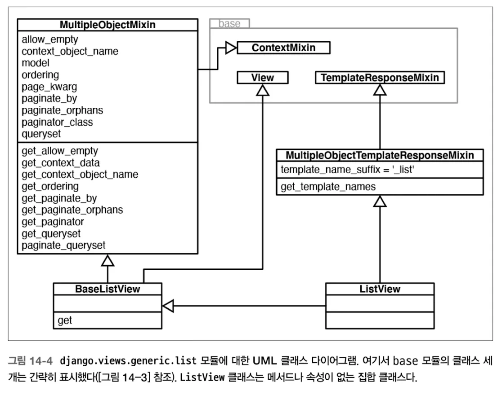
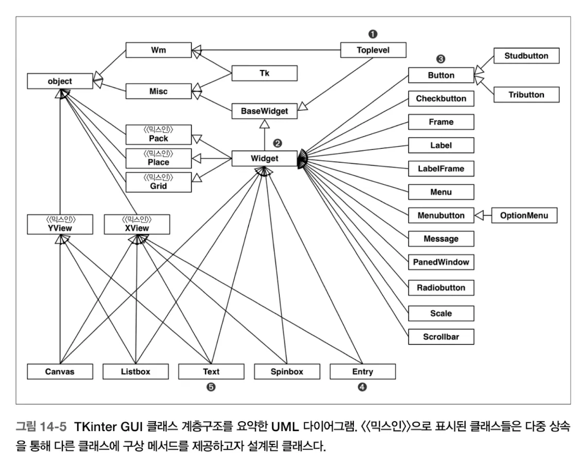

아래 네 가지 특성을 집중해서 살펴본다.

- super() 함수
- 내장형 상속의 위험성
- 다중 상속과 메서드 결정 순서
- 믹스인 클래스

### super() 함수

유지보수가 용이한 객체지향 파이썬 프로그램을 만들기 위해 super() 내장 함수의 일관된 사용이 절대적으로 중요함.

서브클래스가 슈퍼클래스의 메서드를 오버라이드할 때, 일반적으로 오버라이드한 메서드가 슈퍼클래스의 해당 메서드를 호출할 필요가 있음.

ex)

```python
class LastUpdatedOrderedDict(OrderedDict):
    'Store items in the order the keys were last added'

    def __setitem__(self, key, value):
        super().__setitem__(key, value)
        self.move_to_end(key)
```

파이썬 __init__()의 경우 super()를 호출하지 않으면 실행 x

super()의 인자의경우 2와 다르게 자동으로 제공함

### 내장형 상속의 문제점

C 언어로 작성된 내장 클래스의 코드는 사용자가 오버라이드한 코드를 호출하지 않음.

```python
>>> class MyDict(dict):
...     def __setitem__(self, key, value):
...         super().__setitem__(key, [value]*2)
...
>>> dd = MyDict(one=1)
>>> dd # dict 클래스의 __init__은 __setitem__이 오버라이드 되었다는 것을 무시
{'one': 1}
>>> dd['two'] = 2
>>> dd
{'one': 1, 'two': [2, 2]}
>>> dd.update(three=3) # dict의 update도 마찬가지
>>> dd
{'one': 1, 'two': [2, 2], 'three': 3}
```

내장형은 ‘슈퍼클래스에서 구현된 메서드 안에서 호출하더라도 메서드 검색은 대상 객체(self)의 클래스에서 시작해야한다’라는 객체지향 프로그래밍의 기본 규칙을 어김.

굳이 상속 받아서 구현하려면.. UserDict, UserList, UserString 등을 사용하는 [collections 모듈](https://docs.python.org/3/library/collections.html)에서 클래스를 상속하자.

### 다중 상속과 메서드 결정 순서

Method Resolution Order, MRO를 C3 공개 알고리즘 전략에 따라 계산함.

상속 그래프뿐만 아니라 서브 클래스 선언에 나열된 슈퍼클래스의 순서도 고려함.

```python
    A
   / \
  B   C
   \ /
    D

class A:
    def method(self):
        print("A's method")

class B(A):
    def method(self):
        print("B's method")
        super().method()  
        

class C(A):
    def method(self):
        print("C's method")
        super().method() 
        

class D(B, C):
    def method(self):
        print("D's method")
        super().method()  
        

print(D.mro())  
# [<class '__main__.D'>, <class '__main__.B'>, <class '__main__.C'>, <class '__main__.A'>, <class 'object'>]

d = D()
d.method()
'''
D's method
B's method
C's method
A's method
'''

```

`협조적 메서드` : super()를 호출하는 메서드. 이는 협조적 다중 상속을 가능하게 함.

파이썬에서 다중 상속이 제대로 작동하려면 관련된 메서드들의 협조가 필요함.

> 비협조적 메서드는 미묘한 버그의 원인이 될 수 있음. super().method()를 호출 할 때, 궁극적으로 Root.method()까지 활성화 할 것이라고 기대함.
>

이와 관련해서 super().method()가 꼭 자신의 상위 클래스 메서드를 호출하는 것은 아님!

```python
class Root:  
    def ping(self):
        print(f'{self}.ping() in Root')

    def pong(self):
        print(f'{self}.pong() in Root')

    def __repr__(self):
        cls_name = type(self).__name__
        return f'<instance of {cls_name}>'

class A(Root):  
    def ping(self):
        print(f'{self}.ping() in A')
        super().ping()

    def pong(self):
        print(f'{self}.pong() in A')
        super().pong()

class U():  
    def ping(self):
        print(f'{self}.ping() in U')
        super().ping()

class LeafUA(U, A):  
    def ping(self):
        print(f'{self}.ping() in LeafUA')
        super().ping()

>>> u.ping()
<__main__.U object at 0x102e31110>.ping() in U
Traceback (most recent call last):
  File "<stdin>", line 1, in <module>
  File "<stdin>", line 4, in ping
AttributeError: 'super' object has no attribute 'ping'

>>> l = LeafUA()
>>> l.ping()
<__main__.LeafUA object at 0x102e31550>.ping() in LeafUA
<__main__.LeafUA object at 0x102e31550>.ping() in U
<__main__.LeafUA object at 0x102e31550>.ping() in A
<__main__.LeafUA object at 0x102e31550>.ping() in Root
```

### 믹스인 클래스

다중 상속에서 다른 클래스와 함께 사용해서 추가 기능을 제공하는 클래스

적어도 두 개 이상의 클래스가 상속하도록 설계됨. 구상 클래스의 유일한 베이스 클래스가 될 필요 없음. 구상 클래스 기능을 모두 제공하지 않고, 자식이나 형제 클래스들의 작동 방식을 추가하거나 커스터마이즈할 뿐.

예시

```python
import collections

def _upper(key):  # <1>
    try:
        return key.upper()
    except AttributeError:
        return key

class UpperCaseMixin:  # <2>
    def __setitem__(self, key, item):
        super().__setitem__(_upper(key), item)

    def __getitem__(self, key):
        return super().__getitem__(_upper(key))

    def get(self, key, default=None):
        return super().get(_upper(key), default)

    def __contains__(self, key):
        return super().__contains__(_upper(key))

class UpperDict(UpperCaseMixin, collections.UserDict):  
    pass

class UpperCounter(UpperCaseMixin, collections.Counter): 
    """Specialized 'Counter' that uppercases string keys"""  
  
>>> d = UpperDict([('a', 'letter A'), (2, 'digit two')])
>>> list(d.keys())
['A', 2]
>>> d['b'] = 'letter B'
>>> 'b' in d
True
>>> d['a'], d.get('B')
('letter A', 'letter B')
>>> list(d.keys())
['A', 2, 'B']

 >>> c = UpperCounter('BaNanA')
  >>> c.most_common()
  [('A', 3), ('N', 2), ('B', 1)]

```

UpperCaseMixin의 모든 메서드는 super()를 호출함. 동일한 시그니처의 메서드를 구현하거나 상속하는 형제 클래스에 의존함. 따라서 MRO에서 다른 클래스보다 먼저 나와야하고, 클래스 선언할 때 베이스 클래스를 나열하는 튜플에서 가장 먼저 나와야 함.

- 저자가 위 코드를 구현하는데 어려움을 겪었다는 것이 재미있었음.

  ### 표준 라이브러리의 일관성 없는 __missing__() 사용.

  표준 라이브러리의 매핑을 상속한 사용자 정의 클래스들은 __getitem__(), get(), __contains__() 메서드를 구현할 때 키를 찾지 못 하면,  __missing()__을 사용할 수도 있고 그렇지 않을 수도 있음… 자기 맘대로네. 주의해서 상속 받자.


### 실세계에서의 다중 상속

믹스인으로서의 ABC

[collections.abc](http://collections.abc) 패키지가 다중 상속을 많이 사용함.

ThreadingMixIn

```python
class ThreadingMixIn:
    ...
    def process_request_thread(self, request, client_address):
        """Same as in BaseServer but as a thread.

        In addition, exception handling is done here.

        """
        ...

    def process_request(self, request, client_address):
        """Start a new thread to process the request."""
				...
    def server_close(self):
        super().server_close()
        self._threads.join()

class ThreadingHTTPServer(socketserver.ThreadingMixIn, HTTPServer):
    daemon_threads = True
```

> ThreadingHTTPServer은 HTTPServer와 동일하지만 여러 스레드를 이용.
>

장고 제네릭 뷰 믹스인

HTTP 응답은 되게 다양함. 본체 없는 리다이렉션일 수도 잇고, HTML 템플릿으로 랜더링 할 수도 있고 등등..

원래 장고는 제네릭 뷰라고 하는 일련의 함수를 제공했음. 그러나 제니릭 뷰는 함수였으므로 확장할 수 없었음. 제네릭 뷰와 비슷하지만 완전히 똑같지 않은 무언가를 만들려면 처음부터 시작해야 했음.

[이를 믹스인 활용해서 확장성 있게 만들었음.](https://ccbv.co.uk/) 공부하기 좋아 보임.



장고 디스패치 매커니즘은 [템플릿 메서드 패턴](https://refactoring.guru/ko/design-patterns/template-method)을 동적으로 변형한 것

Tkinter에서의 다중 상속



### 상속 처리

실무 프로그래머의 길잡이가 될 만한 상속에 대한 종합적인 이론은 아직 없음.

‘상속을 생각하기 전에 객체 구성을 먼저 생각하라’

‘상속하는 이유를 명확히 이해해라’

- 인터페이스 상속은 is-a 관계를 의미하는 서브타입을 생성한다. 이때는 ABC를 활용하면 가장 좋다
- 구현 상속은 재사용을 통해 코드 중복을 피한다. 이때는 믹스인을 활용할 수 있다.

‘ABC로 인터페이스임을 명시하라’

‘코드를 재사용하려면 믹스인을 사용하라’

- is - a 관계를 나타내지 않고 서로 관련 없는 여러 서브클래스에서 코드를 재사용하고자 설계된 클래스는 명시적으로 믹스인 클래스로 만들어야 한다.
- 개념적으로 믹스인 클래스는 새로운 자료형을 정의하지 않고, 단지 재사용할 메서드들을 묶어놓을 뿐
- 믹스인은 내부 상태를 유지하지 않아야 하므로, 믹스인 클래스는 인스턴스가 없어야 함
- 파이썬에는 클래스가 믹스인임을 나타내는 공식적인 방법이 없으므로, 명명을 잘 하자.

‘사용자에게 집합 클래스를 제공하라’

- 주로 믹스인 클래스를 상속해 만들어지며 자체적인 구조나 행위를 추가하지 않는 클래스를 집합 클래스라고 한다. (아래는 예시)

```python
class ListView(MultipleObjectTemplateResponseMixin, BaseListView):
    """
    Render some list of objects, set by `self.model` or `self.queryset`.
    `self.queryset` can actually be any iterable of items, not just a queryset.
    """
```

‘상속하도록 설계된 클래스만 상속하라’

- 독스트링 잘 보고… 좋은 코드만 상속하자.
- PEP 594 - 타이핑 final도 활용하면 좋다.

  PEP 591 - 타이핑에 final 한정자 추가

  ### 주요 내용:

    1. **typing 모듈에 "final" 한정자를 추가하는 제안**
        - `@final` 데코레이터
        - `Final` 타입 어노테이션

  ### 세 가지 목적:

    1. 메서드가 오버라이드되지 않아야 함을 선언
    2. 클래스가 상속되지 않아야 함을 선언
    3. 변수나 속성이 재할당되지 않아야 함을 선언

  ### @final 데코레이터

    - 클래스나 메서드에 사용되어 상속이나 오버라이딩을 금지
    - 예시:

        ```python
        @finalclass Base:  # 이 클래스는 상속될 수 없음    ...class Base:    @final    def foo(self):  # 이 메서드는 오버라이드될 수 없음        ...
        
        ```


    ### Final 어노테이션
    
    - 변수나 속성이 재할당되지 않아야 함을 나타냄
    - 사용 형태:
        
        ```python
        ID: Final[float] = 1  # 명시적 타입
        ID: Final = 1  # 타입 추론
        ID: Final[float]  # 클래스 바디나 stub 파일에서 우변 생략 가능
        self.id: Final = 1  # __init__ 메서드 내에서만
        
        ```
        
    - 규칙:
        1. 모듈이나 클래스당 특정 속성에 대한 final 선언은 최대 하나
        2. final 이름에는 정확히 하나의 할당만 있어야 함
    
    ### 이 기능의 이점:
    
    1. 상수를 명확하게 표시하고 변경을 방지
    2. 읽기 전용 속성을 생성하고 서브클래스에서 오버라이드 방지
    3. 리터럴이 필요한 상황에서 이름 사용 가능
    
    이 PEP는 파이썬 3.8 버전에서 도입되었으며, 프로그램의 타입 안전성을 높이고 코드 이해도를 향상시키기 위한 목적을 가지고 있습니다.


‘구상 클래스의 상속을 피하라’

- 구상 클래스에는 일반적으로 내부 상태가 있는데, 이 상태에 의존하는 메서드를 오버라이드하면 내부 상태가 손상될 수 있음
- super()를 호출해도 내부 상태는 __x 구문을 많이 사용하기 때문에 버그를 유발할 방법이 너무 많음


후기 : MixIn을 조금 제대로 알게된 장. 흥미로워서 더 공부해봐야 할듯. C++에서 다이아몬드 상속으로 고통받던 친구가 생각남… 상속을 피하는 것이 정말 대세?