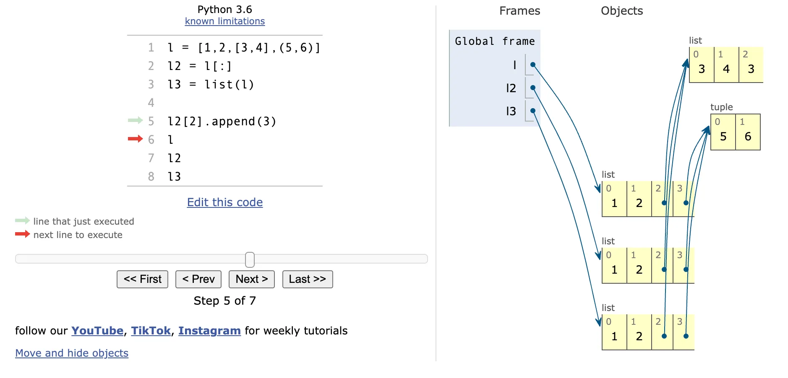

객체와 객체 명의 구분. 이름은 객체가 아니고 별개의 것이다.

- 센티널 객체란

  # 센티널 객체(Sentinel Object)

  ## 개념

  센티널 객체는 특별한 의미를 가진 고유한 객체로, 주로 특수한 조건이나 상태를 나타내기 위해 사용됩니다.

  ## None과의 차이점

    1. **정의 방식**
        - None: 파이썬에 내장된 싱글톤 객체
        - 센티널: 개발자가 직접 생성한 고유 객체 (`object()`)
    2. **사용 목적**
        - None: 일반적인 "값 없음" 표현
        - 센티널: None이 유효한 값일 때 특별한 상태 표시
    3. **활용 상황**
        - None이 실제 데이터로 사용될 때 "찾지 못함" 또는 "종료 조건" 구분 필요시

  ## 구현 방법

    ```python
    _SENTINEL = object()  # 고유한 센티널 객체 생성
    
    ```

  ## 주요 사용 사례

    1. 딕셔너리 키 조회 시 기본값과 키 부재 구분
    2. None이 유효한 값인 컬렉션에서 검색 결과 구분
    3. 함수의 기본 인자로 사용하여 인자 제공 여부 확인
    4. 반복 종료 조건 표시

  ## 예시 코드

    ```python
    def get_value(dictionary, key, default=_SENTINEL):
        result = dictionary.get(key, _SENTINEL)
    
        if result is _SENTINEL:
            if default is _SENTINEL:
                raise KeyError(f"키 '{key}'가 존재하지 않습니다")
            return default
        return result
    
    ```

  센티널 객체는 특히 None과 "값 없음"을 구분해야 하는 복잡한 로직에서 코드의 명확성과 견고성을 높여줍니다.


[약한 참조](https://github.com/L-cloud/fluent-python-2e-extra/blob/main/article5/article5.md)

파이썬 콘솔은 `None`이 아닌 표현식의 결과에 언더바(`_`) 변수를 자동으로 할당. 약한 참조 예시 잘 참고하자.

파이썬 변수는 자바에서의 참조 변수와 같으므로 변수는 객체에 붙은 레이블이라고 생각하는 편이 좋다.

참조 변수를 사용할 때는 변수가 객체에 할당되었다는 표현이 객체를 변수에 할당했다는 표현보다 훨씬 더 적절하다.

> 객체는 변수가 할당되기 전에 생성된다.
>

변수는 단지 레이블일 뿐이므로 객체에 레이블을 여러 개 붙이지 못할 이유가 없음. 여러 레이블을 붙이는 것을 `별칭` 이라고 함.

### 정체성, 동질성, 별칭

== 객체 값 비교

is 객체 정체성(메모리 내 객체 주소라고 생각..) 비교

객체 정체성의 실제 의미는 구현에 따라 다름. CPython에서 id()는 객체의 메모리 주소를 반환하지만 다른 파이썬 인터프리터는 메모리 주소 이외의 값 반환할 수도 있음. 다만 ID는 개체마다 고유한 레이블임을 보장하며 객체가 소멸될 때까지 절대 변하지 않는 다는 점이 핵심이다.

> id() 함수 디버깅할 때 사용. 두 객체의 repr()이 똑같아 보여도 두 참조가 별칭인지, 아니면 별개의 객체를 가리키는지 알 수 있어서.
>

당연히 is가 == 보다 간단하고 빠르며 a == b는 사실 a.__eq__(b) 이거의 문법적 설탕(물론 대부분의 내장형은 eq 메서드 오버라이드해서 객체의 속성값을 고려)

### 튜플의 상대적 불변성

list,dict,set 등 대부분의 파이썬 컬렉션과 마찬가지로 튜플도 객체에 대한 참조를 담는다. 튜플 자체는 불변형이지만, 참조된 항목이 가변형이면 참조된 항목은 변할 수 있다.

### 얇은 복사

생성자나 [:]은 얇은 복사임. 아래는 is가 아님… 일단 참조값을 다 복사한 객체를 새로 생성 하는 것이니.. 헷갈리지 말자.

```python
>>> l = [3, [3,4],5,(6,5)]
>>> l2 = list(l)
>>> l2
[3, [3, 4], 5, (6, 5)]
>>> l
[3, [3, 4], 5, (6, 5)]
>>> l2[1].append(2)
>>> l
[3, [3, 4, 2], 5, (6, 5)]
>>> l2
[3, [3, 4, 2], 5, (6, 5)]
>>> l is l2
False
>>> l == l2
True
```

그림으로는 아래와 같다



### 깊은 복사

일반적으로 깊은 사본을 만드는 일은 간단하지 않다. 객체 안에 순환 참조가 있으면 단순 알고리즘은 바로 무한루프..

deepcopy() 함수는 순환 참조를 제대로 처리하고자 이미 복사한 객체에 대한 참조를 기억함.

깊은 복사가 너무 깊이 복사할 때도 있음. 복사하면 안 되는 외부 리소스나 싱글톤 객체가 참조하기도 함. copy 모듈 문서(https:fpy.li/6-4)에서 설명하는 대로 __copy__()와 __deepcopy__() 특별 메서드를 구현해서 copy()와 deepcopy()의 작동을 제어할 수 있음.

### 참조로서의 함수 매개변수

파이선은 공유로 호출(call by sharing)하는 매개변수 전달 방식만 지원한다. 그냥 자바 참조형일 때 동일.

매개변수 기본값으로 부조당한 가변형. 아래처럼 하지 말자..

```python
class T:
    def __init__(self, a = []):
        pass
```

### del과 가비지 컬렉션

del은 참조를 제거할 뿐 객체를 제거하지 않는다.

- 인터닝
    - *인터닝(Interning)**이란, 주로 **문자열**이나 **불변(immutable) 객체**에 대해 **메모리 사용을 최적화**하고, **객체 비교 속도**를 개선하기 위해 **동일한 값의 객체를 하나만 유지**하는 기법을 말합니다. 보통 다음과 같은 특징이 있습니다:

    1.	**하나의 공통 ‘풀(Pool)’에 저장**

  •	예) 자바의 String Pool, 파이썬의 짧은 문자열 인터닝, .NET의 Intern Pool 등

  •	동일한 내용의 문자열이 여러 번 생성되더라도, 인터닝 풀을 사용하면 실제 메모리에는 오직 **하나의 객체**만 존재

  •	새로운 문자열 생성 시, 풀에서 이미 동일한 내용이 있으면 그 객체의 참조를 재활용

    2.	**객체 비교 속도 향상**

  •	문자열을 비교할 때, 인터닝된 두 문자열이 같은 주소(같은 객체)라면 **참조 비교(==)** 만으로도 동일함을 알 수 있음

  •	일반적으로 문자열 비교는 내부 문자들을 일일이 비교해야 하지만, 인터닝된 객체라면 비교 비용이 크게 줄어듦

    3.	**메모리 효율**

  •	동일한 값의 문자열이 수없이 생성되는 애플리케이션 환경에서는, 인터닝을 통해 **중복 객체를 줄일 수 있음**

  •	다만, 모든 문자열을 무조건 인터닝하면 풀에서 해제되지 못해 메모리를 낭비할 수도 있기 때문에, 언어나 프레임워크마다 적절한 정책(예: 길이가 짧은 문자열만 자동 인터닝)이 존재

    4.	**언어별 동작 방식**

  •	**Java**:

  •	리터럴 문자열("Hello")은 자동으로 **String Pool**에 저장

  •	String.intern() 메서드를 사용해 강제로 풀에 등록 가능

  •	**Python**:

  •	짧은 문자열(주로 알파뉴메릭+언더스코어로 구성된 길이가 짧은 문자열)은 자동 인터닝

  •	필요 시 sys.intern() 함수를 써서 긴 문자열도 수동 인터닝

  •	**C# (.NET)**:

  •	리터럴 문자열은 자동으로 **intern pool**에 올라감

  •	String.Intern() 메서드로 수동 등록 가능

  결론적으로, **인터닝**은 **동일한 값의 객체(특히 문자열)를 한 번만 메모리에 할당**함으로써 중복을 제거하고, **비교 연산**을 단순화하여 **성능**을 높이는 기법입니다. 다만, 무작정 인터닝을 많이 하면 풀에서 제거가 어려워져 메모리를 오래 차지할 수 있으니, 상황에 맞게 사용하는 것이 중요합니다.